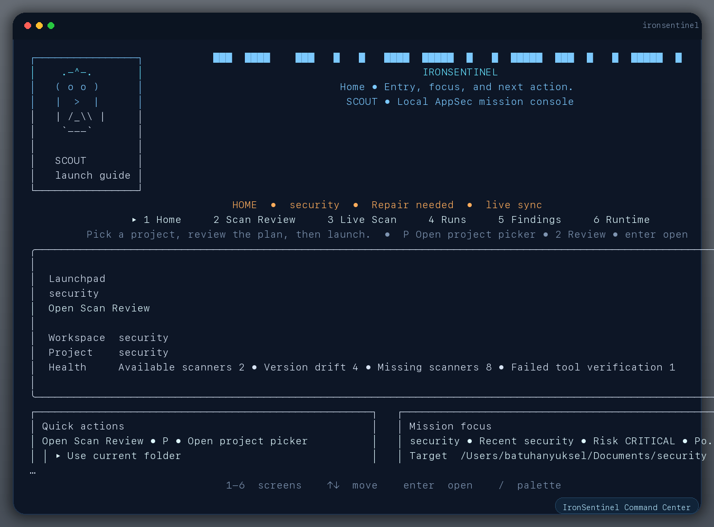
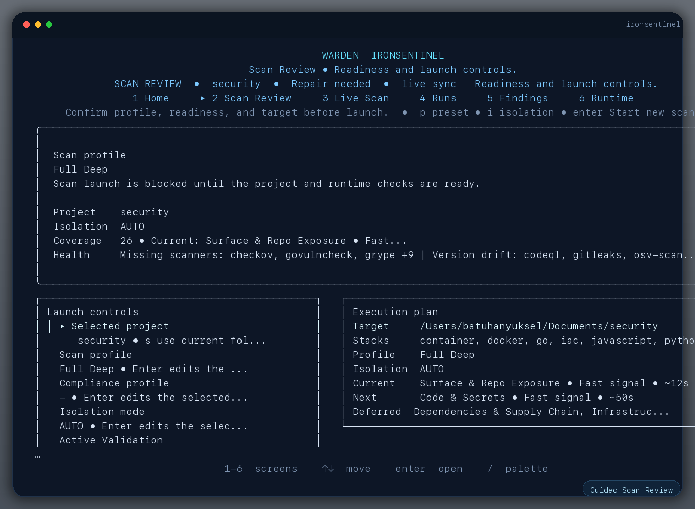
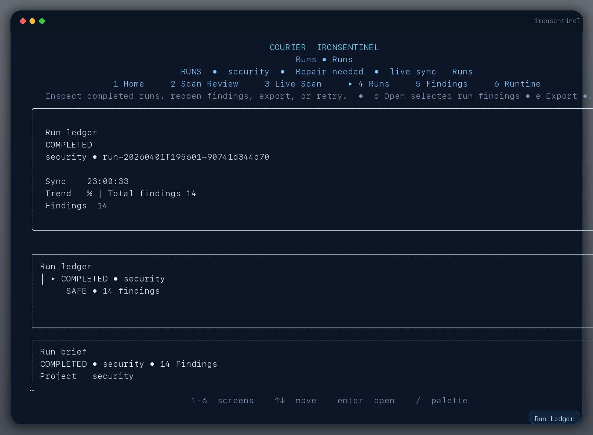
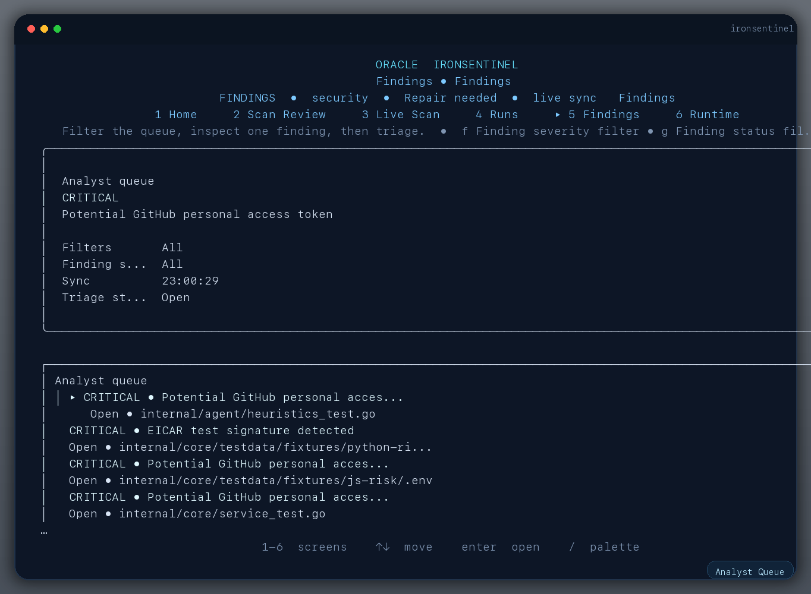

# IronSentinel

<p align="center">
  <strong>Local-first AppSec command center for scanning source trees, verifying runtime trust, reviewing findings, and exporting evidence-rich reports.</strong>
</p>

<p align="center">
  
  
  
  
  
  
</p>

<p align="center">
  
</p>

`IronSentinel` is the primary product and `ironsentinel` is the primary binary.

When you run `ironsentinel` in an interactive terminal, it opens the fullscreen command center by default. The platform keeps project history locally, runs guided security missions, normalizes findings into one model, and exports shareable reports without requiring a hosted control plane.

## Why IronSentinel

- local-first security workflow with data stored under `runtime/data/state.db`
- fullscreen operator console for launch, review, runtime health, and findings triage
- built-in heuristic coverage plus external scanner orchestration when trusted tools are available
- evidence-aware runs with artifacts, execution journals, retry state, and exportable reports
- bilingual operator experience with `English` and `Turkish`
- shell-safe fallbacks for `NO_COLOR`, non-interactive output, and reduced motion

## Product Surfaces

The screenshots below are generated from the real product UI against this repository using a core scan, so the findings queue intentionally shows seeded test fixtures.

| Command center | Guided scan review |
| --- | --- |
|  |  |
| Run ledger | Analyst queue |
|  |  |

## Core Workflow

1. Prepare the trusted runtime.

   ```bash
   ironsentinel setup --target auto --coverage premium
   ironsentinel runtime doctor --mode safe --require-integrity
   ```

2. Open the command center.

   ```bash
   ironsentinel --lang en
   ```

3. Launch a scan directly from the TUI or from the CLI.

   ```bash
   ironsentinel scan /absolute/path --coverage core
   ironsentinel scan /absolute/path --coverage premium
   ironsentinel scan /absolute/path --coverage full
   ```

4. Review findings, compare runs, and export reports.

   ```bash
   ironsentinel findings --run <run-id>
   ironsentinel runs show <run-id>
   ironsentinel export <run-id> --format html --output runtime/output/report.html
   ```

## Coverage Model

IronSentinel ships with always-on heuristics and then expands into deeper coverage when pinned tools are available on `PATH` or through the managed runtime bundle.

| Lane | Built-in coverage | External adapters |
| --- | --- | --- |
| Surface & repo exposure | stack detection, surface inventory, script audit, runtime config audit | semgrep, staticcheck |
| Code & secrets | secret heuristics, evidence capture, execution journals | gitleaks, govulncheck, knip, vulture, codeql |
| Dependencies & supply chain | dependency confusion checks, normalized supply-chain findings | syft, trivy, osv-scanner, grype |
| Infrastructure & config | runtime and IaC heuristics | checkov |
| Malware & suspicious payloads | malware signatures, EICAR validation, binary entropy checks | clamscan |
| Active validation | launch planning and trust gating | nuclei, OWASP ZAP Automation Framework |

Default scans use `premium` coverage. For a portable built-in-only pass on a fresh machine, use `--coverage core`.

## Reporting And Evidence

Every scan can persist:

- normalized findings with severity, triage state, and review metadata
- module manifests with command, working directory, environment allowlist, and exit code
- execution journals including retry, timeout, and failure taxonomy
- local evidence files for heuristic detections
- raw scanner outputs when external tools emit structured results

Export formats:

- `HTML` for human-readable review
- `SARIF` for code scanning and CI integrations
- `CSV` for operational handoff and spreadsheet workflows

Examples:

```bash
ironsentinel export <run-id> --format html --output runtime/output/report.html
ironsentinel export <run-id> --format sarif --baseline <baseline-run-id>
ironsentinel export <run-id> --format csv --output runtime/output/findings.csv
```

## Command Map

| Job | Command |
| --- | --- |
| Open the fullscreen command center | `ironsentinel` |
| Open the static posture overview | `ironsentinel overview` |
| Run a guided scan mission | `ironsentinel scan /absolute/path --coverage premium` |
| Register the current project | `ironsentinel init` |
| Pick a folder and start scanning | `ironsentinel pick` |
| Inspect findings | `ironsentinel findings --run <run-id>` |
| Review a single finding interactively | `ironsentinel review <fingerprint> --run <run-id>` |
| Inspect recent runs | `ironsentinel runs list` / `ironsentinel runs show <run-id>` |
| Watch the queue or a specific run | `ironsentinel runs watch <run-id>` |
| Validate runtime trust | `ironsentinel runtime doctor --mode safe --require-integrity` |
| Run the queue worker once or continuously | `ironsentinel daemon --once` / `ironsentinel daemon` |
| Export reports | `ironsentinel export <run-id> --format html|sarif|csv` |

## Accessibility And Operator Fallbacks

- `NO_COLOR=1` switches styled command surfaces to plain shell-safe output.
- `IRONSENTINEL_REDUCED_MOTION=1` disables non-essential TUI animation.
- `ironsentinel config language en|tr` persists the preferred interface language.
- `ironsentinel config ui-mode standard|plain|compact` stores the preferred TUI density mode.

## Build From Source

```bash
go mod tidy
go build ./cmd/ironsentinel
```

The project targets Go `1.25.x`.

## Local Quality Gate

Run the same local quality gate used by release validation:

```bash
bash scripts/quality_local.sh
```

This executes:

- `go test ./...`
- `bash scripts/coverage_gate.sh`
- `go vet ./...`
- `staticcheck ./...`
- `golangci-lint run --config .golangci.yml --concurrency 2 ./...`
- a core self-scan with `ironsentinel`

Coverage artifacts are written to:

- `coverage/internal.out`
- `coverage/internal-summary.txt`
- `coverage/internal-packages.txt`

Default minimum internal coverage is `45.0%` and can be overridden with `COVERAGE_MIN`.

## Repository Layout

| Path | Purpose |
| --- | --- |
| `cmd/ironsentinel` | main product binary |
| `cmd/releasectl` | release verification and lock hydration tooling |
| `internal/cli` | fullscreen TUI, static surfaces, and command routing |
| `internal/agent` | scanner orchestration, runtime probing, and module adapters |
| `internal/core` | stateful workflows, portfolio data, findings, and runtime doctor |
| `internal/reports` | HTML, SARIF, and CSV export paths |
| `internal/store` | local SQLite state store |
| `scripts` | local quality gate, smoke checks, and release automation |
| `docs` | release discipline, audits, and design notes |

## Runtime And Release Discipline

- support matrix and capability tiers: [`docs/release-discipline.md`](docs/release-discipline.md)
- setup + runtime smoke check: `bash scripts/smoke_setup_doctor.sh`
- shell guard smoke check: `bash scripts/smoke_shell_guards.sh`
- Windows shell guard smoke check: `pwsh scripts/smoke_shell_guards.ps1`
- release publish preflight: `bash scripts/release_publish_preflight.sh --version vX.Y.Z --require-signing --require-tag`
- release artifact preflight: `bash scripts/release_artifact_preflight.sh --dir dist/vX.Y.Z --require-signing --require-external-attestation`

## Representative Commands

```bash
go run ./cmd/ironsentinel
go run ./cmd/ironsentinel overview
go run ./cmd/ironsentinel scan /absolute/path --coverage core
go run ./cmd/ironsentinel scan /absolute/path --coverage premium --fail-on-new high
go run ./cmd/ironsentinel findings --severity high --limit 20
go run ./cmd/ironsentinel runs show <run-id>
go run ./cmd/ironsentinel runtime doctor --mode safe --require-integrity
go run ./cmd/ironsentinel export <run-id> --format html --output runtime/output/report.html
go run ./cmd/releasectl verify --dir dist/<version> --lock scanner-bundle.lock.json --require-signature --require-attestation --require-external-attestation
```

For the full command surface, run:

```bash
ironsentinel --help
ironsentinel <command> --help
```

## License

IronSentinel is available under the [MIT License](LICENSE).
