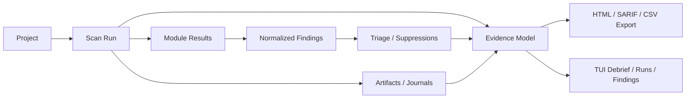

# IronSentinel Architecture

## Product Model

IronSentinel has one primary operator workflow:

1. `ironsentinel` with no arguments opens the fullscreen command center in an interactive terminal.
2. Non-interactive surfaces such as `overview`, `runtime`, and `export` stay shell-safe and automation-friendly.
3. Compatibility commands (`console`, `open`, `pick`, `tui`) remain callable during migration, but they are hidden from primary help and redirect operators toward the canonical flow.

This keeps the user-facing model simple:

- one primary operator surface
- one project-to-run-to-finding lifecycle
- one reporting pipeline for HTML, SARIF, and CSV

## Command Surface

First-class commands:

- `scan`
- `findings`
- `runs`
- `runtime`
- `export`
- `setup`
- `projects`
- `review`
- `triage`
- `config`
- `github`
- root invocation (`ironsentinel`)

Authenticated DAST planning stays inside the existing `scan` and `dast plan` surfaces. The command contract is:

- `--target name=url` for target declaration
- `--target-auth name=profile` for explicit target-to-auth binding
- `--dast-auth-file <json>` for reusable auth profile definitions
- `dast auth-template [type]` for canonical JSON profile scaffolding
- `runs gate|policy --vex-file <openvex.json>` for VEX-aware policy and regression decisions
- `runs verify-sbom-attestation --file <json>` for artifact digest verification

This keeps target intent, auth material, and execution policy separate.

Supporting commands:

- `overview` for shell-safe posture output
- `daemon` for queue execution and automation workflows
- compatibility wrappers kept only for migration continuity

## UI Surface Model

### Fullscreen command center

Implemented in `internal/cli/app_shell.go` and companion route files/helpers.

Primary routes:

- `Home`
- `Scan Review`
- `Live Scan`
- `Runs`
- `Findings`
- `Runtime`

Route rules:

- `Home` is the only hero-heavy surface.
- Operational routes use compact chrome and master-detail structure.
- Async route/detail loaders must reject stale responses.
- `NO_COLOR=1` forces plain output.
- `IRONSENTINEL_REDUCED_MOTION=1` disables decorative motion.
- Non-TTY execution never depends on the fullscreen surface.

### Shell-safe reports

Implemented in `internal/cli/surface.go`, `internal/cli/dashboard.go`, and plain-report helpers.

These are the durable automation/reporting surfaces for:

- `overview`
- `runtime`
- machine-readable exports

### GitHub integration

Implemented in `internal/integrations/github` with CLI orchestration in `internal/cli`.

Responsibilities:

- export IronSentinel high-confidence secret regexes in GitHub custom pattern form
- resolve authentication from `GITHUB_TOKEN`, `GH_TOKEN`, or `gh auth token`
- resolve repository, ref, and commit metadata from the workspace or explicit overrides
- export SARIF for code scanning uploads
- build dependency snapshots for the GitHub dependency graph
- enumerate outgoing git commits and install the managed pre-push hook used by local push protection
- persist remediation campaigns locally and publish them to GitHub Issues through the campaign CLI family

Boundary rule:

- `internal/cli` resolves run and project references, canonicalizes report and dependency payloads, and then calls the GitHub integration client.
- `internal/integrations/github` owns HTTP requests, token handling, repository parsing, and upload submission details.

This keeps the GitHub command family separate from the core scan, run, and report pipelines while still reusing the existing canonical run/report model.

## Remediation Campaigns

Campaigns are local-first work items stored in SQLite and surfaced through the existing `campaigns` command family. They are created from selected findings or runs, can be listed and inspected locally, and are published to GitHub only when the operator explicitly requests it.

TUI visibility is intentionally lightweight in phase one:

- run and finding detail panes surface a campaign creation hint
- no dedicated campaign route is introduced
- the existing scan, run, and findings workflows remain the primary navigation path

This keeps remediation planning discoverable without turning the command center into a second campaign workspace.

Hook installation is intentionally surfaced under `setup` because it is local onboarding work. The installed hook delegates back into `ironsentinel github push-protect`, which keeps the actual push-guard behavior in the same integration family as SARIF upload and dependency submission.

## Backend Boundaries

### `internal/agent`

Scanner/runtime integration layer.

Responsibilities:

- module catalog, lane planning, and evidence capture
- runtime probing and bundle discovery
- target resolution
- scan streaming/orchestration support
- authenticated DAST automation plan generation from reusable auth profiles

Key rule: tool probing and version parsing must be deterministic and bounded.

### `internal/core`

Stateful product workflows.

Responsibilities:

- project registration
- scan queue lifecycle
- finding normalization and triage
- runtime doctor augmentation
- portfolio read models
- canonical report/export preparation

Key rule: UI surfaces should read portfolio state through shared service read models instead of ad-hoc store queries during rendering.

### `internal/store`

SQLite persistence.

Responsibilities:

- durable project/run/finding state
- queue claiming and terminal updates
- artifacts, suppressions, triage persistence
- integrity check support

Key rule: state transitions should be persisted once and emitted consistently from one mutation path.

### `internal/reports`

Formatting layer for:

- HTML
- SARIF
- CSV
- OpenVEX
- SBOM attestation

Key rule: all formats should derive from the same evidence model rather than recomputing inconsistent metadata per exporter.

## State Flow

## Runtime Trust Model

Runtime trust combines two layers:

1. bundle/runtime availability from `internal/agent`
2. operator-facing runtime doctor checks from `internal/core`

Runtime doctor checks are categorized so CLI and TUI interpret them consistently:

- `availability`
- `integrity`
- `network`
- `filesystem`
- `release`

Current built-in checks already cover integrity, filesystem, and network. Release-focused checks are surfaced through the release verification tooling and should remain part of the same conceptual model.

## Evidence And Reporting

Each run can produce:

- normalized findings
- module execution metadata
- retry/timeout traces
- collected artifacts
- exported reports

The reporting contract is:

- machine-readable formats must stay raw on stdout when requested
- human-readable reports must remain shell-safe outside TTY mode
- all report formats must derive from one canonical `RunReport` payload
- evidence protection policy must be shared across module artifacts and generated reports
- permissions for local exported evidence should stay restrictive by default

## Documentation Policy

Durable product docs live in:

- `README.md`
- `docs/architecture.md`
- `docs/release-discipline.md`

Generated audits, remediation plans, and one-off reviews are historical documents. They should be explicitly marked as archival snapshots and should not be treated as the current product contract.

Archive location:

- `docs/archive/`
